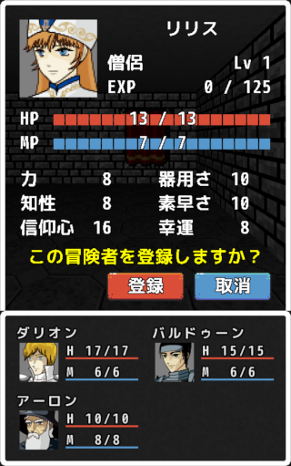
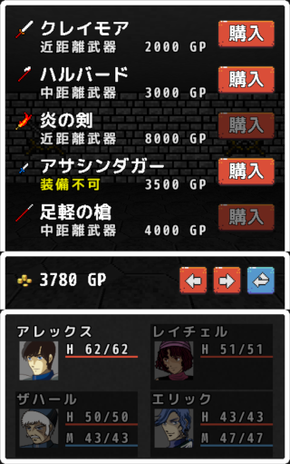
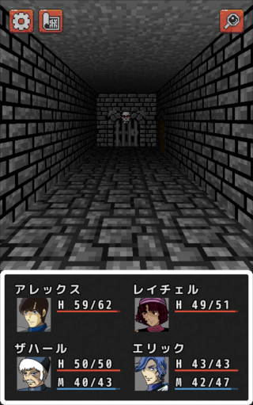
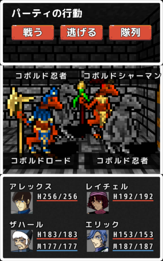
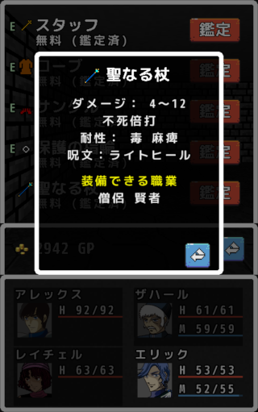

# エーテリアの迷宮　(Labyrinth of Aetheria)

## ゲーム説明

クラシックな3Dダンジョン型RPGで、モンスターとの戦いやアイテムの収集が中心です。舞台は辺境の街エーテリア、ここは伝説の聖杯が眠ると噂されています。多くの冒険者が莫大な報酬を求めて集まり、危険に満ちたダンジョンに挑戦します。プレイヤーの最終的な目標は、数々の試練を乗り越えて聖杯を手にすることです。

## 製作者

じみ猫 

X(旧Twitter) : [@jimineko2000](https://twitter.com/jimineko2000)

## アプリダウンロード先
[https://play.google.com/store/apps/details?id=jp.jimineko.dungeon&pli=1](https://play.google.com/store/apps/details?id=jp.jimineko.dungeon&pli=1)

## ゲーム画面スクリーンショット

    
